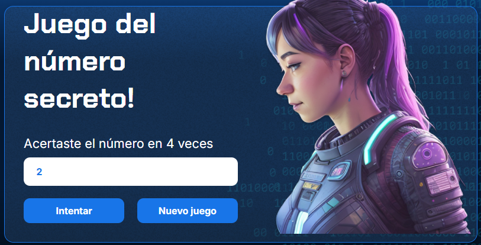

# Proyecto del Número Secreto

## Descripción principal

Este proyecto se realizó como ejercicio de práctica en la materia **Introducción a Lógica de Programación en JavaScript** del curso **ONE** de **ALURA LATAM**, en conjunto con **ORACLE EDUCATION**.

## Descripción general

El proyecto consta de los siguientes archivos:

- **`style.css`**: Brinda el estilo a la página web con la que el usuario interactuará. En este archivo se definen los estilos de los elementos HTML, colores, fuentes, márgenes y la disposición en pantalla.
- **`index.html`**: Es el esqueleto de la página web. Contiene la estructura básica y el contenido principal, como textos, imágenes y otros elementos. Es el punto de partida para construir la página web.
- **`app.js`**: Contiene el código JavaScript que añade interactividad a la página. En este archivo se han agregado funciones que permiten la interacción del usuario con la página web, haciéndola dinámica e intuitiva.

## Objetivo del proyecto

Este proyecto consiste en la creación de un juego donde el usuario debe adivinar un número secreto, el cual se genera de forma aleatoria al iniciar el juego. Los números válidos van del **1 al 10**, y el usuario recibe pistas para encontrar el número correcto.

## Estado del proyecto
   

## Descripción del código y funcionalidad

- El número secreto se genera aleatoriamente cada vez que se inicia el juego.

- El usuario ingresa un número y recibe pistas para ayudarlo a encontrar el número secreto.

- Hay dos botones en la interfaz:
  - **`Intentar`**: Permite validar el número ingresado.
  - **`Nuevo Juego`**:Permanece inactivo y en color gris hasta que el usuario acierta el número. Luego de esto, se activa y su color es azúl, permitiendo que el usuario reinicie el juego.

## Acceso al proyecto

Para ejecutar y/o modificar el proyecto:

1. Descarga los archivos haciendo click en **`Code`** y seleccionando **`Download ZIP`**, realiza la extracción de los archivos y ábrelos en **Visual Studio Code (VSCode)**.

2. Para actualizar automáticamente la página al modificar `app.js`, instala la extensión **Live Server** en VSCode y abre `index.html` con ella.

---------------------

3. Para analizar la lógica del juego en el navegador, usa **Google Chrome** y accede a la consola de desarrolladores:
   - **Menú → Más herramientas → Herramientas para desarrolladores → Consola**
  

## Tecnologías utilizadas

- **JavaScript**
- **Visual Studio Code (VSCode)**
- **Google Chrome**

## Personas contribuyentes y desarrolladores

La cátedra proporcionó los archivos base `style.css` e `index.html`. El archivo `app.js` fue desarrollado y documentado por **mí** siguiendo la guía de las clases asincrónicas.
